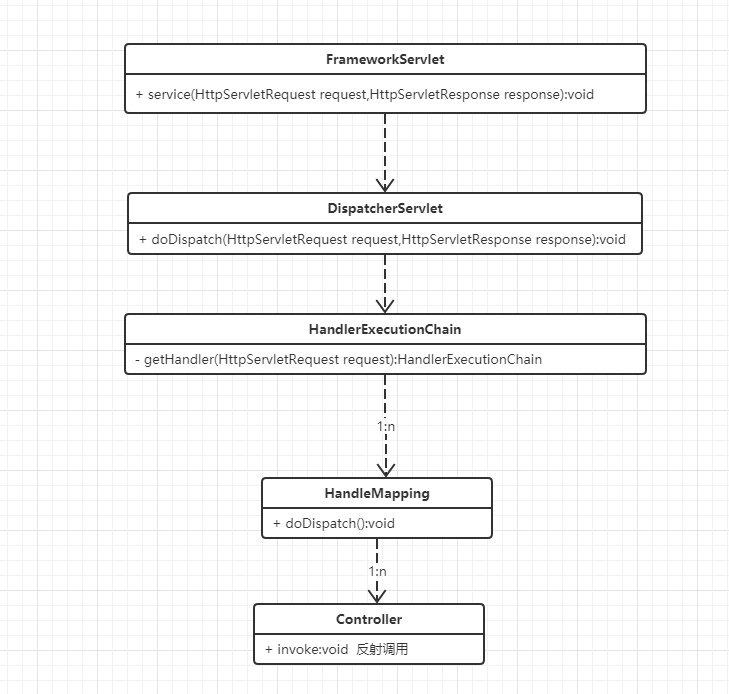
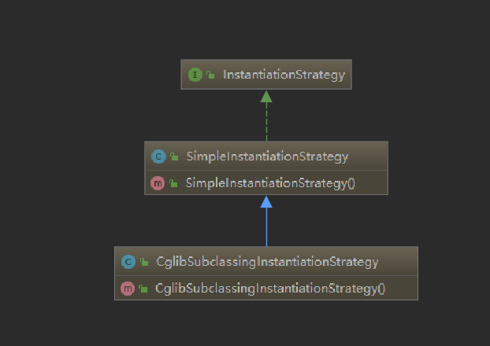

1、举例Spring源码中你见过的委派模式，并画出类关系图。

DispatchServlet



InstantiationStrategy




2、利用策略模式重构一段业务代码。

公共类

```java
public abstract class Pay{
    public abstract String getName();
    public void pay(){
        System.out.println(getName()+"支付");
    }
}
public class AliPay extends Pay{
    public String getName(){
        return "阿里";
    }
}
public class JdPay extends Pay{
    public String getName(){
        return "京东";
    }
}
```

重构前

```java
public class PayService {
    public void pay(String payKey){
        if(StringUtils.equals(payKey,"alipay")){
            new AliPay().pay();
        }else{
            new JdPay().pay();
        }
    }
}
```

重构后

```java
public interface PayType{
    String ALIPAY = "alipay";
    String JDPAY = "jdpay";
}
public class PayFactory{
    private static final Map<String,Pay> payMap = new HashMap<>();
    static{
        payMap.put(PayType.ALIPAY,new AliPay());
        payMap.put(PayType.JDPAY,new JdPay());
    }
    public static Pay getPay(String payKey){
        return payMap.get(payKey)
    }
}
public class PayService {
    public void pay(String payKey){
        PayFactory.getPay(payKey).pay();
    }
}
```

