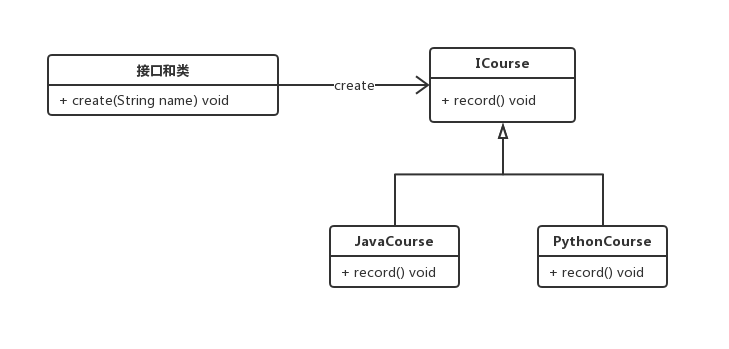
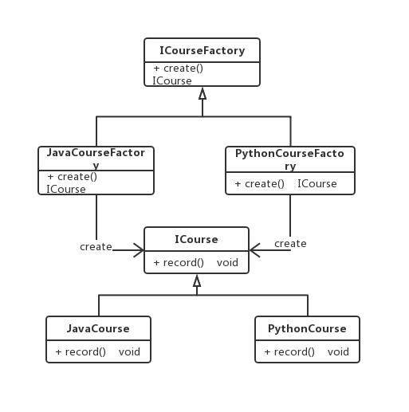
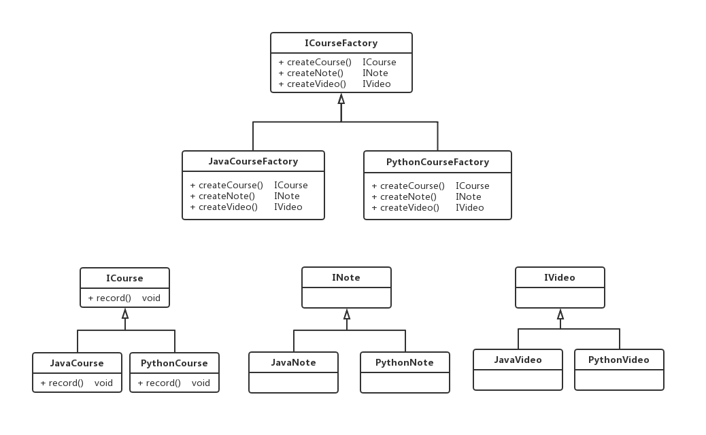

1、用UML绘制出三种工厂模式的类结构图。









2、深刻理解产品族和产品等级结构之间的关系。

正方形，圆形和菱形三种图形，相同颜色深浅的就代表同一个产品族，相同形状的代表同一个产品等级结构。

3、自主完成三种工厂模式的代码实现，理解简单工厂、工厂方法和抽象工厂的区别。

**公共类**

```java
public interface ICourse {
    /**
     * 录制视频
     * @return
     */
    void record();
}
public class JavaCourse implements ICourse {

    public void record() {
        System.out.println("录制Java课程");
    }
}
public class PythonCourse implements ICourse {

    public void record() {
        System.out.println("录制Python课程");
    }
}
```

**简单工厂**

使用场景：工厂类负责创建的对象较少。客户端只需要传入工厂类的参数，对于如何创建对象的逻辑不需 要关心。

优点：只需传入一个正确的参数，就可以获取你所需要的对象 无须知道其创建的细节。

缺点：工厂类的职责相对过重，增加新的产品时需要修改工厂类的判断 逻辑，违背开闭原则。
不易于扩展过于复杂的产品结构。

```java
public class CourseFactory {
    public ICourse create(Class<? extends ICourse> clazz){
        try {
            if (null != clazz) {
                return clazz.newInstance();
            }
        }catch (Exception e){
            e.printStackTrace();
        }
        return null;
    }
}
```

**工厂方法**

使用场景：创建对象需要大量重复的代码。客户端（应用层）不依赖于产品类实例如何被创建、实现等细节。一个类通过其子类来指定创建哪个对象。

优点：用户只需关心所需产品对应的工厂，无须关心创建细节。加入新产品符合开闭原则，提高了系统的可扩展性

缺点：类的个数容易过多，增加了代码结构的复杂度。增加了系统的抽象性和理解难度。

```java
public interface ICourseFactory {
    ICourse create();
}
public class JavaCourseFactory implements ICourseFactory {
    public ICourse create() {
        return new JavaCourse();
    }
}
public class PythonCourseFactory implements ICourseFactory {
    public ICourse create() {
        return new PythonCourse();
    }
}
public class FactoryMethodTest {
    public static void main(String[] args) {
        ICourseFactory factory = new PythonCourseFactory();
        ICourse course = factory.create();
        course.record();
        factory = new JavaCourseFactory();
        course = factory.create();
        course.record();
    }
}
```

**抽象工厂**

使用场景：客户端（应用层）不依赖于产品类实例如何被创建、实现等细节。
强调一系列相关的产品对象（属于同一产品族）一起使用创建对 象需要大量重复的代码。
提供一个产品类的库，所有的产品以同样的接口出现，从而使客 户端不依赖于具体实现。

优点：具体产品在应用层代码隔离，无须关心创建细节
将一个系列的产品族统一到一起创建。

缺点：规定了所有可能被创建的产品集合，产品族中扩展新的产品困难， 需要修改抽象工厂的接口。
增加了系统的抽象性和理解难度

```java
public interface INote {
    void edit();
}
public interface IVideo {
    void record();
}
public interface CourseFactory {
    INote createNote();
    IVideo createVideo();
}
public class JavaNote implements INote {
    public void edit() {
        System.out.println("编写Java笔记");
    }
}
public class JavaVideo implements IVideo {
    public void record() {
        System.out.println("录制Java视频");
    }
}
public class JavaCourseFactory implements CourseFactory {
    public INote createNote() {
        return new JavaNote();
    }
    public IVideo createVideo() {
        return new JavaVideo();
    }
}
public class PythonNote implements INote {
    public void edit() {
        System.out.println("编写Python笔记");
    }
}
public class PythonVideo implements IVideo {
    public void record() {
        System.out.println("录制Python视频");
    }
}
public class PythonCourseFactory implements CourseFactory {
    public INote createNote() {
        return new PythonNote();
    }
    public IVideo createVideo() {
        return new PythonVideo();
    }
}
public class AbstractFactoryTest {
    public static void main(String[] args) {
        JavaCourseFactory factory = new JavaCourseFactory();
        factory.createNote().edit();
        factory.createVideo().record();
    }
}
```


