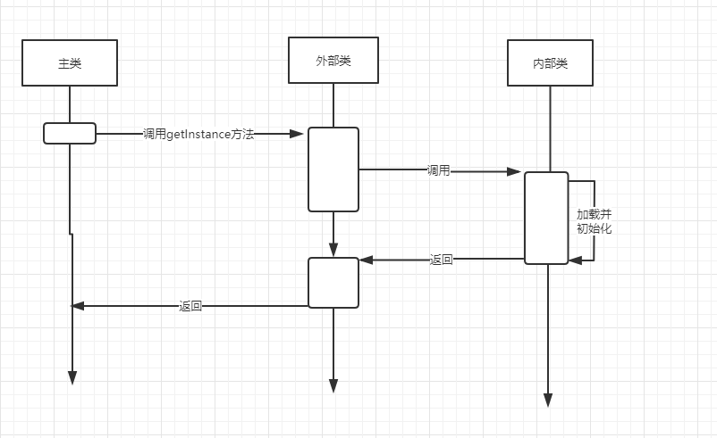

1、熟练掌握单例模式的常见写法。

2、总结每种单例写法的优、缺点。

**饿汉单例**

优点：没有加任何的锁、执行效率比较高，在用户体验上来说，比懒汉式更好。 

缺点：类加载的时候就初始化，不管用与不用都占着空间，浪费了内存，有可能占着茅 坑不拉屎 

```java
public class HungrySingleton {
    //先静态、后动态
    //先属性、后方法
    //先上后下
    private static final HungrySingleton hungrySingleton = new HungrySingleton();

    private HungrySingleton(){}

    public static HungrySingleton getInstance(){
        return  hungrySingleton;
    }
}
```

**懒汉单例**

优点：被外部类调用时才创建实例 

缺点：典型的时间换空间，也就是每次获取实例都会进行判断，看是否需要创建实例，浪费判断的时间 

```java
//懒汉式单例
//在外部需要使用的时候才进行实例化
public class LazySimpleSingleton {
    private LazySimpleSingleton(){}
    //静态块，公共内存区域
    private static LazySimpleSingleton lazy = null;
    public synchronized static LazySimpleSingleton getInstance(){
        if(lazy == null){
            lazy = new LazySimpleSingleton();
        }
        return lazy;
    }
}
```

**注册式单例**

优点：将每一个实例都缓存到统一的容器中，使用唯一标识获取实例 

缺点：线程不安全

```java
public class ContainerSingleton {
    private ContainerSingleton(){}
    private static Map<String,Object> ioc = new ConcurrentHashMap<String,Object>();
    public static Object getInstance(String className){
        synchronized (ioc) {
            if (!ioc.containsKey(className)) {
                Object obj = null;
                try {
                    obj = Class.forName(className).newInstance();
                    ioc.put(className, obj);
                } catch (Exception e) {
                    e.printStackTrace();
                }
                return obj;
            } else {
                return ioc.get(className);
            }
        }
    }
}
```

**本地线程单例**

优点：保证线程内部的全局唯一，且天生线程安全 

缺点：线程外不安全

```java
public class ThreadLocalSingleton {
    private static final ThreadLocal<ThreadLocalSingleton> threadLocalInstance =
            new ThreadLocal<ThreadLocalSingleton>(){
                @Override
                protected ThreadLocalSingleton initialValue() {
                    return new ThreadLocalSingleton();
                }
            };

    private ThreadLocalSingleton(){}

    public static ThreadLocalSingleton getInstance(){
        return threadLocalInstance.get();
    }
}
```


3、思考破坏单例模式的方式有哪些？并且归纳总结。

**反射破坏单例**

```java
public class LazyInnerClassSingletonTest {

    public static void main(String[] args) {
        try{
            //很无聊的情况下，进行破坏
            Class<?> clazz = LazyInnerClassSingleton.class;

            //通过反射拿到私有的构造方法
            Constructor c = clazz.getDeclaredConstructor(null);
            //强制访问，强吻，不愿意也要吻
            c.setAccessible(true);

            //暴力初始化
            Object o1 = c.newInstance();

            //调用了两次构造方法，相当于new了两次
            //犯了原则性问题，
            Object o2 = c.newInstance();

            System.out.println(o1 == o2);
//            Object o2 = c.newInstance();
        }catch (Exception e){
            e.printStackTrace();
        }
    }
}
```

**序列化破坏单例** 

```java
public class SeriableSingletonTest {
    public static void main(String[] args) {

        SeriableSingleton s1 = null;
        SeriableSingleton s2 = SeriableSingleton.getInstance();

        FileOutputStream fos = null;
        try {
            fos = new FileOutputStream("SeriableSingleton.obj");
            ObjectOutputStream oos = new ObjectOutputStream(fos);
            oos.writeObject(s2);
            oos.flush();
            oos.close();


            FileInputStream fis = new FileInputStream("SeriableSingleton.obj");
            ObjectInputStream ois = new ObjectInputStream(fis);
            s1 = (SeriableSingleton)ois.readObject();
            ois.close();

            System.out.println(s1);
            System.out.println(s2);
            System.out.println(s1 == s2);

        } catch (Exception e) {
            e.printStackTrace();
        }
    }
}
```

4、梳理内部类的执行逻辑，并画出时序图。

```java
public class HungryStaticSingleton {
    private static final HungryStaticSingleton hungrySingleton;
    static {
        hungrySingleton = new HungryStaticSingleton();
    }
    private HungryStaticSingleton(){}
    public static HungryStaticSingleton getInstance(){
        return  hungrySingleton;
    }
}
```

