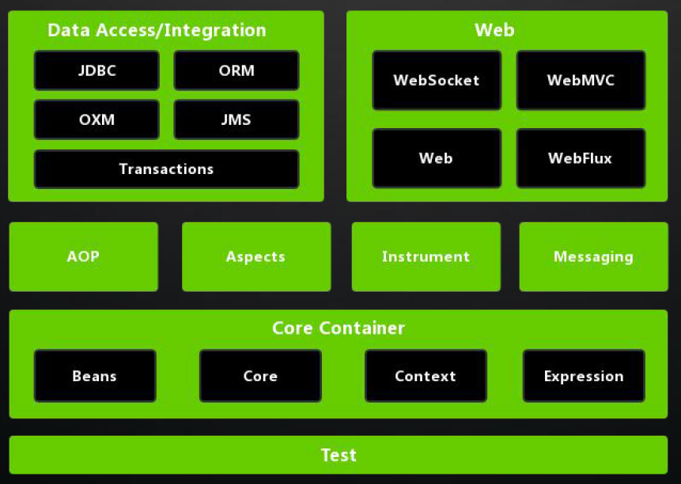
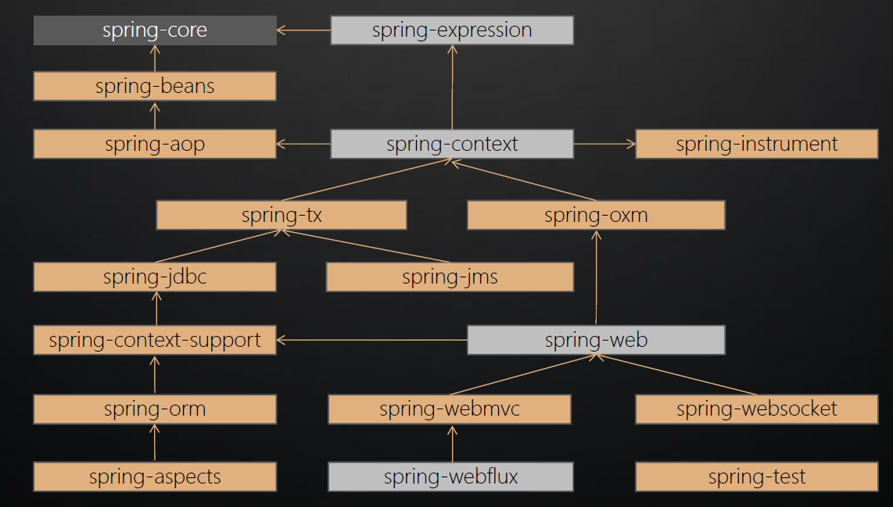
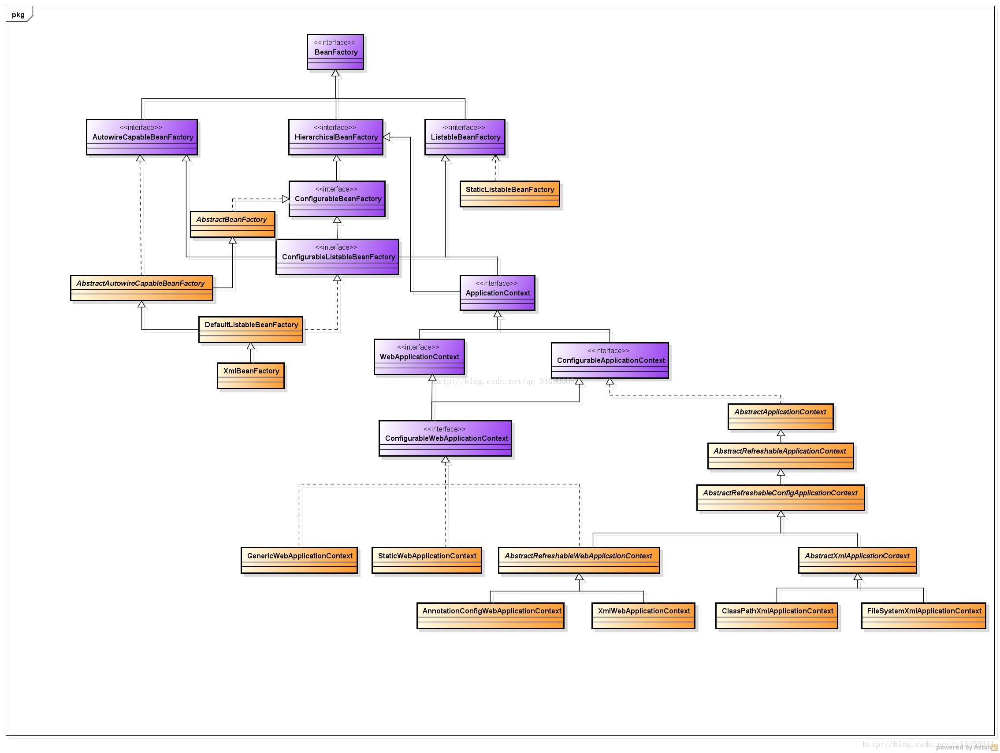

1、使用ProcessOn绘制Spring系统架构图。

2、整理笔记，完全理解Spring各模块之间的依赖关系。

3、理解SpringIOC容器的核心作用，生成类关系图。

核心作用是控制反转，实例由容器创建，已接口BeanFactory接口为核心，他是工厂模式的具体实现，对应用程序的配置和依赖性规范与实际的应用程序代码进行分离，但BeanFactory容器实例化后并不会自动实例化Bean，只有当Bean被使用时BeanFactory容器才会对该Bean进行实例化与依赖关系的装配

 

4、安装配置Gradle环境，构建Spring源码。

到官网下载4.3版本的gradle，再配置环境变量，然后用idea导入