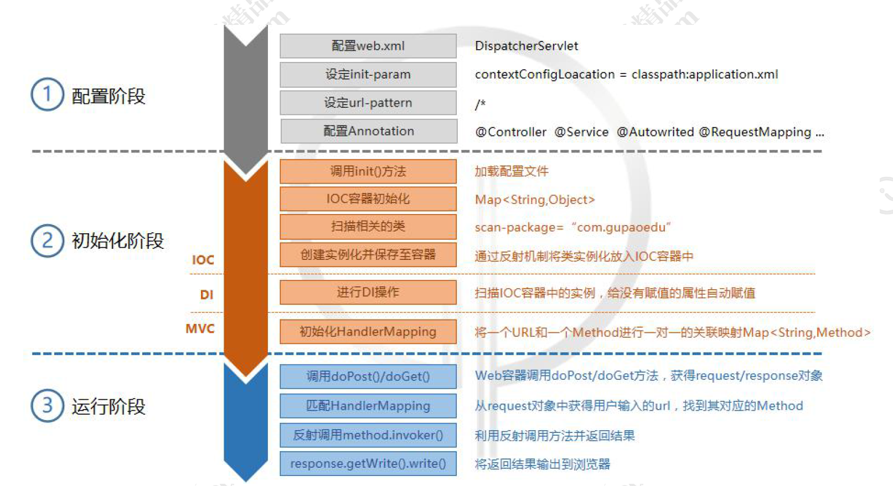

1、理解SpringIOC、DI、MVC的基本执行原理。

如下图所示，经历三个阶段，其中初始化阶段为IOC和DI的处理，运行阶段为mvc处理



2、自己手写一个Mini版本的SpringMVC。

先配置一个配置文件，用来application.properties

```properties
scanPackage=com.myproject.demo
```

然后配置web.xml

```xml
<?xml version="1.0" encoding="UTF-8"?>
<web-app xmlns:xsi="http://www.w3.org/2001/XMLSchema-instance"
	xmlns="http://java.sun.com/xml/ns/j2ee" xmlns:javaee="http://java.sun.com/xml/ns/javaee"
	xmlns:web="http://java.sun.com/xml/ns/javaee/web-app_2_5.xsd"
	xsi:schemaLocation="http://java.sun.com/xml/ns/j2ee http://java.sun.com/xml/ns/j2ee/web-app_2_4.xsd"
	version="2.4">
	<display-name>My Web Application</display-name>
	<servlet>
		<servlet-name>mymvc</servlet-name>
		<servlet-class>com.myproject.mvcframework.v1.servlet.MyDispatcherServlet</servlet-class>
		<init-param>
			<param-name>contextConfigLocation</param-name>
			<param-value>application.properties</param-value>
		</init-param>

		<load-on-startup>1</load-on-startup>
	</servlet>
	<servlet-mapping>
		<servlet-name>mymvc</servlet-name>
		<url-pattern>/*</url-pattern>
	</servlet-mapping>
</web-app>
```

mvc类

```java
@MyController
@MyRequestMapping("/demo")
public class DemoAction {

  	@MyAutowired private IDemoService demoService;

	@MyRequestMapping("/query")
	public void query(HttpServletRequest req, HttpServletResponse resp,
					  @GPRequestParam("name") String name){
//		String result = demoService.get(name);
		String result = "My name is " + name;
		try {
			resp.getWriter().write(result);
		} catch (IOException e) {
			e.printStackTrace();
		}
	}

	@MyRequestMapping("/add")
	public void add(HttpServletRequest req, HttpServletResponse resp,
					@MyRequestParam("a") Integer a, @MyRequestParam("b") Integer b){
		try {
			resp.getWriter().write(a + "+" + b + "=" + (a + b));
		} catch (IOException e) {
			e.printStackTrace();
		}
	}

	@MyRequestMapping("/remove")
	public void remove(HttpServletRequest req,HttpServletResponse resp,
					   @MyRequestParam("id") Integer id){
	}
}
```

注解类

```java
@Target({ElementType.FIELD})
@Retention(RetentionPolicy.RUNTIME)
@Documented
public @interface MyAutowired {
    String value() default "";
}
@Target({ElementType.TYPE})
@Retention(RetentionPolicy.RUNTIME)
@Documented
public @interface MyController {
    String value() default "";
}
@Target({ElementType.TYPE,ElementType.METHOD})
@Retention(RetentionPolicy.RUNTIME)
@Documented
public @interface MyRequestMapping {
    String value() default "";
}
@Target({ElementType.PARAMETER})
@Retention(RetentionPolicy.RUNTIME)
@Documented
public @interface MyRequestParam {
    String value() default "";
}
@Target({ElementType.TYPE})
@Retention(RetentionPolicy.RUNTIME)
@Documented
public @interface MyService {
    String value() default "";
}
```

mvc核心类

```java
public class MyDispatcherServlet extends HttpServlet {
    private Map<String,Object> mapping = new HashMap<String, Object>();
    @Override
    protected void doGet(HttpServletRequest req, HttpServletResponse resp) throws ServletException, IOException {this.doPost(req,resp);}
    @Override
    protected void doPost(HttpServletRequest req, HttpServletResponse resp) throws ServletException, IOException {
        try {
            doDispatch(req,resp);
        } catch (Exception e) {
            resp.getWriter().write("500 Exception " + Arrays.toString(e.getStackTrace()));
        }
    }
    private void doDispatch(HttpServletRequest req, HttpServletResponse resp) throws Exception {
        String url = req.getRequestURI();
        String contextPath = req.getContextPath();
        url = url.replace(contextPath, "").replaceAll("/+", "/");
        if(!this.mapping.containsKey(url)){resp.getWriter().write("404 Not Found!!");return;}
        Method method = (Method) this.mapping.get(url);
        Map<String,String[]> params = req.getParameterMap();
        method.invoke(this.mapping.get(method.getDeclaringClass().getName()),new Object[]{req,resp,params.get("name")[0]});
    }

    //当我晕车的时候，我就不去看源码了

    //init方法肯定干得的初始化的工作
    //inti首先我得初始化所有的相关的类，IOC容器、servletBean
    @Override
    public void init(ServletConfig config) throws ServletException {
        InputStream is = null;
        try{
            Properties configContext = new Properties();
            is = this.getClass().getClassLoader().getResourceAsStream(config.getInitParameter("contextConfigLocation"));
            configContext.load(is);
            String scanPackage = configContext.getProperty("scanPackage");
            doScanner(scanPackage);
            for (String className : mapping.keySet()) {
                if(!className.contains(".")){continue;}
                Class<?> clazz = Class.forName(className);
                if(clazz.isAnnotationPresent(MyController.class)){
                    mapping.put(className,clazz.newInstance());
                    String baseUrl = "";
                    if (clazz.isAnnotationPresent(MyRequestMapping.class)) {
                        MyRequestMapping requestMapping = clazz.getAnnotation(GPRequestMapping.class);
                        baseUrl = requestMapping.value();
                    }
                    Method[] methods = clazz.getMethods();
                    for (Method method : methods) {
                        if (!method.isAnnotationPresent(MyRequestMapping.class)) {  continue; }
                        MyRequestMapping requestMapping = method.getAnnotation(MyRequestMapping.class);
                        String url = (baseUrl + "/" + requestMapping.value()).replaceAll("/+", "/");
                        mapping.put(url, method);
                        System.out.println("Mapped " + url + "," + method);
                    }
                }else if(clazz.isAnnotationPresent(MyService.class)){
                        MyService service = clazz.getAnnotation(MyService.class);
                        String beanName = service.value();
                        if("".equals(beanName)){beanName = clazz.getName();}
                        Object instance = clazz.newInstance();
                        mapping.put(beanName,instance);
                        for (Class<?> i : clazz.getInterfaces()) {
                            mapping.put(i.getName(),instance);
                        }
                }else {continue;}
            }
            for (Object object : mapping.values()) {
                if(object == null){continue;}
                Class clazz = object.getClass();
                if(clazz.isAnnotationPresent(GPController.class)){
                    Field [] fields = clazz.getDeclaredFields();
                    for (Field field : fields) {
                        if(!field.isAnnotationPresent(MyAutowired.class)){continue; }
                        MyAutowired autowired = field.getAnnotation(MyAutowired.class);
                        String beanName = autowired.value();
                        if("".equals(beanName)){beanName = field.getType().getName();}
                        field.setAccessible(true);
                        try {
                            field.set(mapping.get(clazz.getName()),mapping.get(beanName));
                        } catch (IllegalAccessException e) {
                            e.printStackTrace();
                        }
                    }
                }
            }
        } catch (Exception e) {
        }finally {
            if(is != null){
                try {is.close();} catch (IOException e) {
                    e.printStackTrace();
                }
            }
        }
        System.out.print("GP MVC Framework is init");
    }
    private void doScanner(String scanPackage) {
        URL url = this.getClass().getClassLoader().getResource("/" + scanPackage.replaceAll("\\.","/"));
        File classDir = new File(url.getFile());
        for (File file : classDir.listFiles()) {
            if(file.isDirectory()){ doScanner(scanPackage + "." +  file.getName());}else {
                if(!file.getName().endsWith(".class")){continue;}
                String clazzName = (scanPackage + "." + file.getName().replace(".class",""));
                mapping.put(clazzName,null);
            }
        }
    }
}
```

