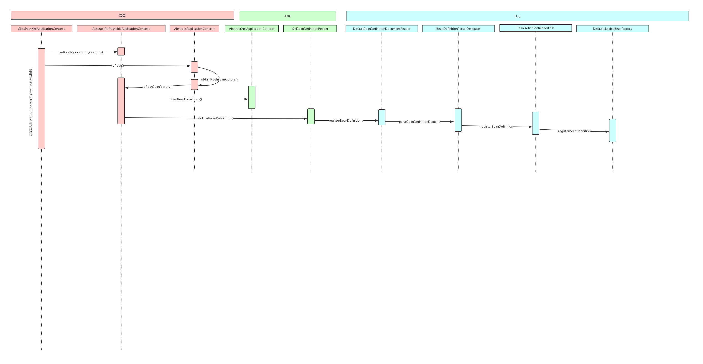

# 1、使用ProcessOn绘制SpringIOC容器初始化过程的时序图。

# 2、整理笔记，完全理解SpringIOC容器的核心原理和设计模式的应用背景。

核心原理如下：

IOC(Inversion of Control)控制反转：所谓控制反转，就是把原先我们代码里面需要实现的对象创 建、依赖的代码，反转给容器来帮忙实现。那么必然的我们需要创建一个容器，同时需要一种描述来让 容器知道需要创建的对象与对象的关系。这个描述最具体表现就是我们所看到的配置文件 

应用背景：

用了抽象工厂的设计模式，顶级接口是Beanfactory，下面有带继承关系的HierarchicalBeanfactory,带自动装配规则的AutowireCapableBeanfactory,可列表化的ListableBeanfactory, 让其相关子类来实现功能，这些都是接口只是声明了规范，真正实现功能的是ApplicationContext，作为spring的高级IOC容器创建bean，其能力如下，

1.支持信息源，可以实现国际化（实现MessageSource接口）

2.访问资源。（实现ResourcePatternResolver接口）

3.支持应用事件。（实现ApplicationEventPublisher接口）

解析配置的时候用了策略模式，比如配置源为xml，file，propertie的

# 3、加强理解练习，掌握看源码的要领；看源码从此不晕车。

BeanFactory
ClassPathXmlApplicationContext#refresh()
    定位:getResource()
    加载:reader.loadBeanDefinition()
    注册:registerBeanDefinition()
        注册到:DefaultListableBeanFactory的Map<String , BeanDefinition> beanDefinitionMap中。
        注册的事配置文件中的信息