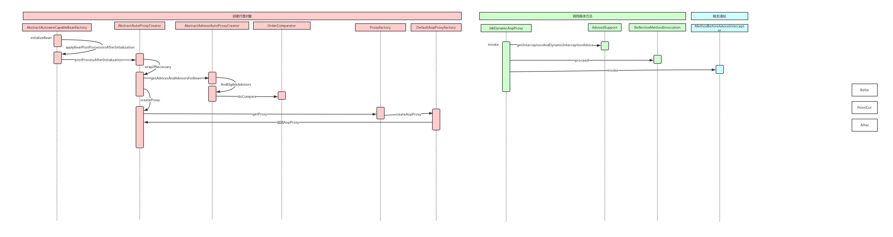

# **1、使用ProcessOn绘制Spring AOP容器初始化过程的时序图。**

# 2、整理笔记，完全理解Spring AOP容器的核心原理和设计模式的应用背景。

核心原理：

应用jdk动态代理和cglib动态代理对目标方法进行增强，如果目标类是接口就使用策略模式切换到jdk动态代理增强目标类，也就是创建接口实现类的代理对象，和接口实现类平级，实现和接口实现类相同的功能，如果目标类不是接口就用cglib动态代理对目标类增强，也就是子类调用父类的方法完成增强

应用背景如下：

AOP 是OOP 的延续，是AspectOrientedProgramming的缩写，意思是面向切面编程。可以通过预
编译方式和运行期动态代理实现在不修改源代码的情况下给程序动态统一添加功能的一种技术。AOP
设计模式孜孜不倦追求的是调用者和被调用者之间的解耦，AOP可以说也是这种目标的一种实现。
我们现在做的一些非业务，如：日志、事务、安全等都会写在业务代码中(也即是说，这些非业务类横切
于业务类)，但这些代码往往是重复，复制——粘贴式的代码会给程序的维护带来不便，AOP 就实现了
把这些业务需求与系统需求分开来做。这种解决的方式也称代理机制。 

# 3、加强理解练习，掌握看源码的要领；看源码从此不晕车。

几个概念
1.切面(Aspect):面向规则，具有相同规则的方法的集合体
2.通知(Advice):回调
3.切入点(Pointcut):需要代理的具体方法
4.代理对象(TargetObject):被代理的对象
5.AOP代理(AOP Proxy):主要有两种方式JDK、CGLIB
6.前置通知(BeforeAdvice):在invoke Pointcut之后调用，织入的方法
7.后置通知(AfterAdvice):Pointcut之后调用，织入的方法
8.返回后通知(After Retunrn Advice):返回值为非void，织入的方法
9.环绕通知(Around Advice):只要触发调用，织入的方法
10.异常通知(After Throwing Advice):Pointcut抛出异常，织入的方法

主要流程
1.寻找入口
2.选择策略
3.调用方法
4.触发通知

AOP
AbstractAutowireCapableBeanFactory#getProxy()保存到BeanWrapper
    JDK/CGLib
    List<ReflectiveMethodIntercepter>和proceed()
    适配器Advice:Before、After