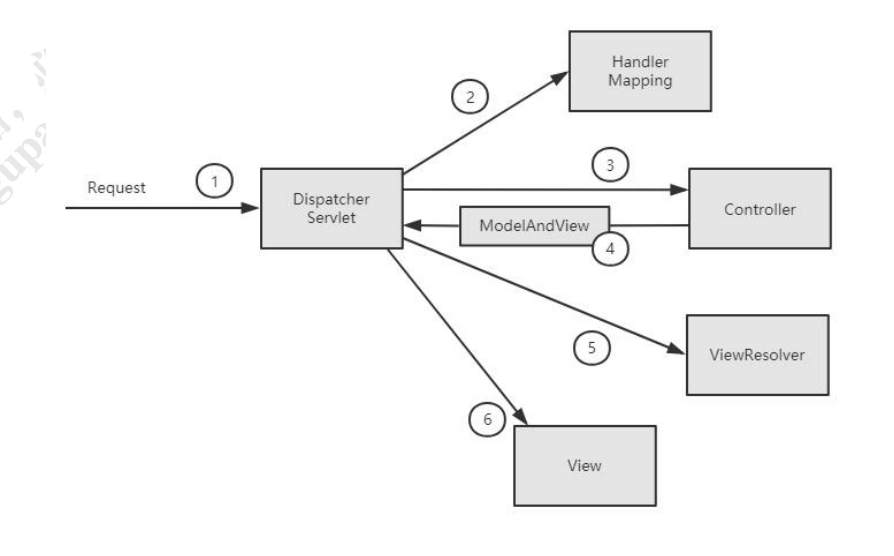

**1、使用ProcessOn绘制Spring MVC容器初始化过程的时序图。**

**2、整理笔记，完全理解Spring MVC容器的核心原理和设计模式的应用背景。**

核心原理图如下：

从上图中看到①、DispatcherServlet 是 SpringMVC 中的前端控制器(Front Controller), 负责接收 Request 并将 Request 转发给对应的处理组件。 ② 、 HanlerMapping 是 SpringMVC 中 完 成 url 到 Controller 映 射 的 组 件 。 DispatcherServlet 接 收 Request, 然 后 从 HandlerMapping 查 找 处 理 Request 的 Controller。 ③、Controller 处理 Request,并返回 ModelAndView 对象,Controller 是 SpringMVC 中负责处理 Request 的组件(类似于 Struts2 中的 Action),ModelAndView 是封装结果 视图的组件。 ④、⑤、⑥视图解析器解析 ModelAndView 对象并返回对应的视图给客户端。 在前面的章节中我们已经大致了解到，容器初始化时会建立所有 url 和 Controller 中的 Method 的对应关系，保存到 HandlerMapping 中，用户请求是根据 Request 请求的 url 快速定位到 Controller 中的某个方法。在 Spring 中先将 url 和 Controller 的对应关 系,保存到 Map中。Web 容器启动时会通知 Spring 初始化容器(加载 Bean 的定义信息和初始化所有单例 Bean),然后 SpringMVC 会遍历容器中的 Bean，获 取每一个 Controller 中的所有方法访问的 url，然后将 url 和 Controller 保存到一个 Map 中；这样就可以根据 Request 快速定位到 Controller，因为最终处理 Request 的是 Controller 中的方法，Map 中只保留了 url 和 Controller 中的对应关系，所以要根据 Request 的 url 进一步确认 Controller 中的 Method，这一步工作的原理就是拼接 Controller 的 url(Controller 上@RequestMapping 的值)和方法的 url(Method 上 @RequestMapping 的值)，与 request 的 url 进行匹配，找到匹配的那个方法；确定处 理请求的 Method 后，接下来的任务就是参数绑定，把 Request 中参数绑定到方法的形 式参数上，这一步是整个请求处理过程中最复杂的一个步骤。 

应用背景如下：

Spring框架提供了构建Web应用程序的全功能MVC模块。使用Spring可插入的MVC架构，可以选择是使用内置的Spring Web框架还是Struts这样的Web框架。通过策略接口，Spring框架是高度可配置的，而且包含多种视图技术，例如JavaServer Pages(JSP)技术、Velocity、Tiles、iText和POL。Spring MVC框架并不知道使用的视图，所以不会强迫您只使用JSP技术。Spring MVC分离了控制器、模型对象、分派器以及处理程序对象的角色，这种分离让它们更容易进行定制 

**3、加强理解练习，掌握看源码的要领；看源码从此不晕车**。

从三个部分来分析Spring MVC 的源代码。
其一，ApplicationContext 初始化时用Map 保存所有url 和Controller 类的对应关系；
其二，根据请求url 找到对应的Controller，并从Controller 中找到处理请求的方法;
其三，Request 参数绑定到方法的形参，执行方法处理请求，并返回结果视图

**初始化阶段**
我们首先找到DispatcherServlet 这个类，必然是寻找init()方法。然后，我们发现其init方法其实在父类HttpServletBean 中，又调用了一个重要的initServletBean() 方法。进入initServletBean()方法，最终会调用refresh()方法，前面的章节中对IOC 容器的初始化细节我们已经详细掌握，在此我们不再赘述。我们看到上面的代码中，IOC 容器初始化之后，最后有调用了onRefresh()方法。这个方法最终是在DisptcherServlet 中实现到这一步就完成了Spring MVC 的九大组件的初始化。接下来，我们来看url 和Controller的关系是如何建立的呢？HandlerMapping 的子类AbstractDetectingUrlHandlerMapping 实现了initApplicationContext()方法，所以
我们直接看子类中的初始化容器方法determineUrlsForHandler(String beanName)方法的作用是获取每个Controller 中的url，不同的子类有不同的实现，这是一个典型的模板设计模式。因为开发中我们用的最多的就是用注解来配置Controller 中的url ， BeanNameUrlHandlerMapping 是AbstractDetectingUrlHandlerMapping 的子类,处理注解形式的url 映射.所以我们这里以BeanNameUrlHandlerMapping 来进行分析。我们看
BeanNameUrlHandlerMapping 是如何查beanName 上所有映射的url到这里HandlerMapping 组件就已经建立所有url 和Controller 的对应关系。
**运行调用阶段**
这一步步是由请求触发的，所以入口为DispatcherServlet 的核心方法为doService()，doService()中的核心逻辑由doDispatch()实现，getHandler(processedRequest)方法实际上就是从HandlerMapping 中找到url 和Controller 的对应关系。也就是Map<url,Controller>。我们知道，最终处理Request的是Controller 中的方法，我们现在只是知道了Controller，我们如何确认Controller中处理Request 的方法呢？继续往下看。从Map<urls,beanName>中取得Controller 后，经过拦截器的预处理方法，再通过反射获取该方法上的注解和参数，解析方法和参数上的注解，然后反射调用方法获取ModelAndView 结果视图。最后，调用的就是RequestMappingHandlerAdapter 的
handle()中的核心逻辑由handleInternal(request, response, handler)实现。整个处理过程中最核心的逻辑其实就是拼接Controller 的url 和方法的url，与Request的url 进行匹配，找到匹配的方法。已经可以找到处理Request 的Controller 中的方法了，现在看如何解析该方法上的参数，并反射调用该方法。invocableMethod.invokeAndHandle()最终要实现的目的就是：完成Request 中的参数和方法参数上数据的定。Spring MVC 中提供两种Request 参数到方法中参数的绑定方式：
1、通过注解进行绑定，@RequestParam。
2、通过参数名称进行绑定。
使用注解进行绑定，我们只要在方法参数前面声明@RequestParam("name")，就可以将request 中参数name 的值绑定到方法的该参数上。使用参数名称进行绑定的前提是必须要获取方法中参数的名称，Java 反射只提供了获取方法的参数的类型，并没有提供获取参数名称的方法。SpringMVC 解决这个问题的方法是用asm 框架读取字节码文件，来获取方法的参数名称。asm 框架是一个字节码操作框架，关于asm 更多介绍可以参考其官网。个人建议，使用注解来完成参数绑定，这样就可以省去asm 框架的读取字节码的操作。关于asm 框架获取方法参数的部分,这里就不再进行分析了。感兴趣的小伙伴可以继续深入了解这个处理过程。到这里,方法的参数值列表也获取到了,就可以直接进行方法的调用了。整个请求过程中最复杂的一步就是在这里了。到这里整个请求处理过程的关键步骤都已了解。理解了Spring MVC 中的请求处理流程,整个代码还是比较清晰的。

**Spring MVC 使用优化建议**
上面我们已经对SpringMVC 的工作原理和源码进行了分析，在这个过程发现了几个优化
点:
1、Controller 如果能保持单例，尽量使用单例这样可以减少创建对象和回收对象的开销。也就是说，如果Controller 的类变量和实例变量可以以方法形参声明的尽量以方法的形参声明，不要以类变量和实例变量声明，这
样可以避免线程安全问题。
2、处理Request 的方法中的形参务必加上@RequestParam 注解这样可以避免Spring MVC 使用asm 框架读取class 文件获取方法参数名的过程。即便Spring MVC 对读取出的方法参数名进行了缓存，如果不要读取class 文件当然是更好。
3、缓存URL
阅读源码的过程中，我们发现Spring MVC 并没有对处理url 的方法进行缓存，也就是说每次都要根据请求url 去匹配Controller 中的方法url，如果把url 和Method 的关系缓存起来，会不会带来性能上的提升呢？有点恶心的是，负责解析url 和Method 对应关系的ServletHandlerMethodResolver 是一个private 的内部类，不能直接继承该类
增强代码，必须要该代码后重新编译。当然，如果缓存起来，必须要考虑缓存的线程安全问题。